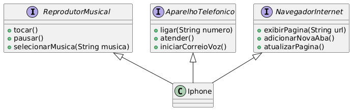

## Table of contents

- [Overview](#overview)
    - [O Desafio](#o-desafio)
    - [UML](#esquema-uml)
- [Meu Processo](#meu-processo)
    - [Feito com](#feito-com)
    - [O Que Aprendi](#o-que-aprendi)
- [Autor](#autor)

## Overview

### O Desafio

No desafio,tive que modelar e diagramar a representação UML do componente iPhone, abrangendo suas funcionalidades como Reprodutor Musical, Aparelho Telefônico e Navegador na Internet.

### Esquema UML

### Link

- Solução URL: [Link da Solução](https://github.com/mlzzi/dio-desafio-iphone)

## Meu processo

### Feito com

- IntelliJ
- Java
- PlantUML Web

### O que aprendi

A importância de criar esquemas UML e como isso ajuda a visualizar o projeto antes de implementá-lo.
Aprendi também características da linguagem Java e OOP e suas características como encapsulamento, herança, polimorfísmo e abstração.
Em especial nesse projeto foram usados o conceito de Interface.

## Autor

- Linkedin - [Murilo Luzzi](https://www.linkedin.com/in/muriloluzzi/)
- GitHub - [@mlzzi](https://github.com/mlzzi)